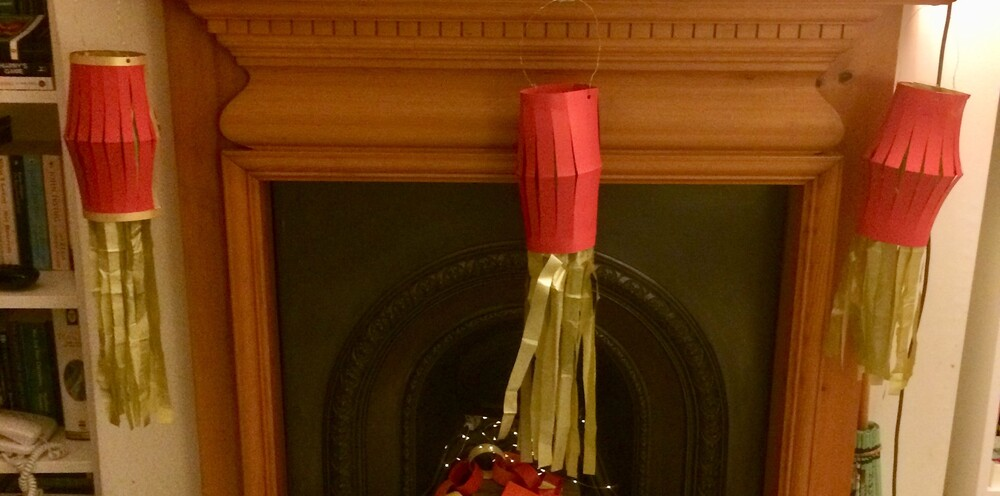
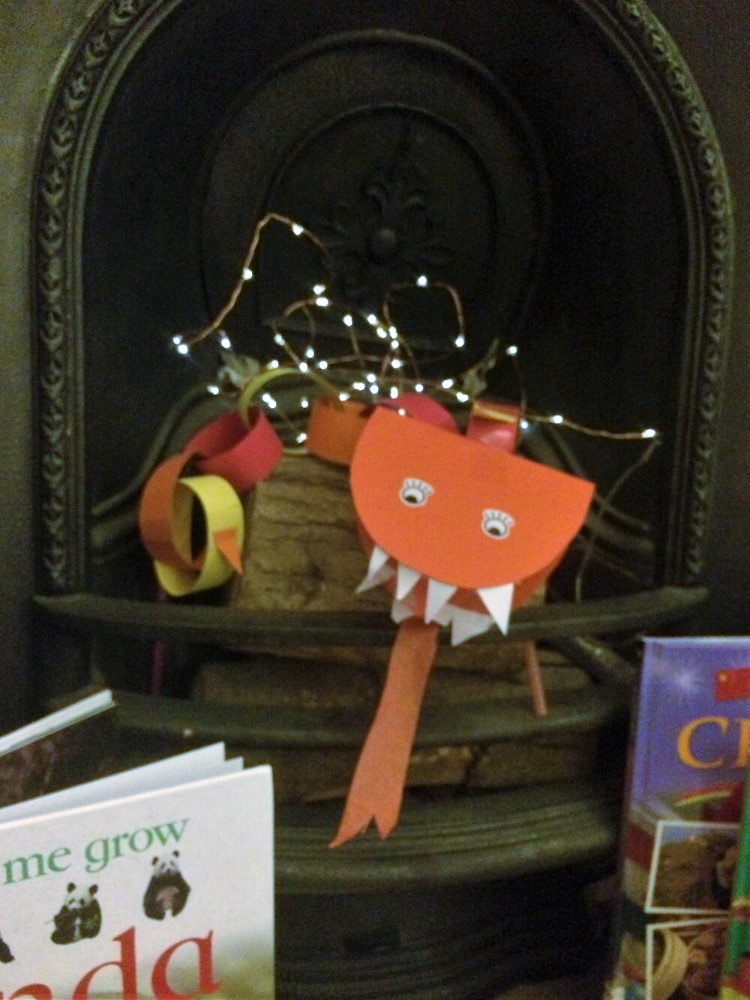

**Happy New Year!**

The children happily made [paper lanterns](https://www.firstpalette.com/craft/paper-lantern.html) for days.

<!--  -->


My eldest attended a library session and bought back a [New Year Dragon](https://www.scholastic.com/teachers/articles/teaching-content/chinese-new-year-dragon-craft-project/).

<!--  -->


I made a more complicated [lantern](https://www.youtube.com/watch?v=c32wLubQRw8). It looks lovely and I had fun but it was more time consuming.

<!--  -->


>Books ['The Great Race'](https://www.waterstones.com/book/the-great-race/christopher-corr/9781786037312) and ['Panda'](https://www.worldofbooks.com/en-gb/books/dk/panda/9781405328678?gclid=EAIaIQobChMIgviDpfev7gIVu2DmCh3C6Q4REAQYBiABEgKZOfD_BwE).

<!--  -->


The [pigs](https://www.wonderlandmodels.com/products/schleich-pig/?exchange_rate=1) are from my [Schleich](https://www.schleich-s.com/en/GB/farm-world.html) collection.

<!--  -->


I used [pompoms](https://www.schleich-s.com/en/GB/farm-world.html), left over from Christmas, for fruit and left them to be placed onto
my drawing of a willow tree. 

<!--  -->


For an extra challenge I left chopsticks. My eldest is loves using chopsticks and my youngest was willing
to give it a go. Partially helped by this great game [Totem Zen](https://www.crafts4kids.co.uk/djeco-game-of-skill-and-speed-totem-zen).
It's hard to get hold of now but this is one of my favourite [Djeco](http://www.djeco.com/en/games-toys/games) games. I'm sure you could
make your own but the matching cards are great and you can play this as a one player game, tackling each difficulty level at time or selecting
at random.

